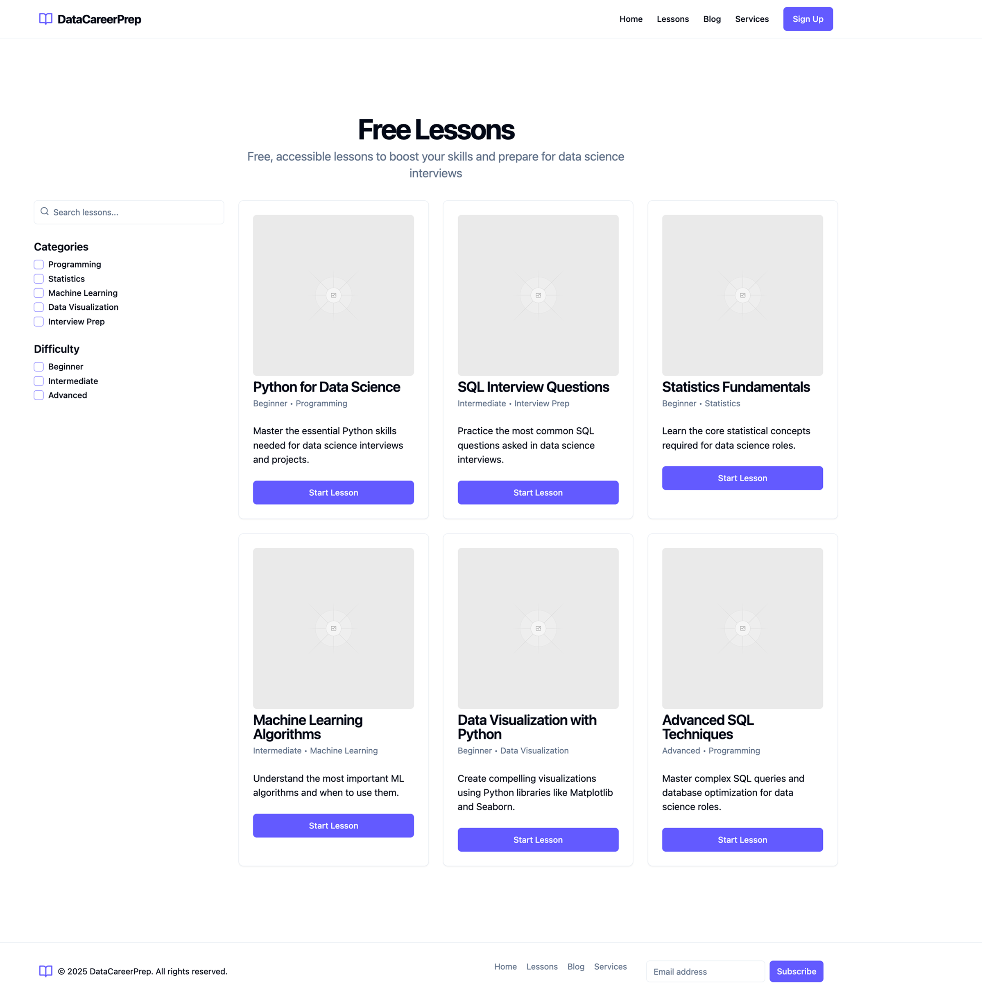

# careerprep-website-demo

## Client Demo:  React-based Prototype for Data Science Career Prep Site 

This repository contains a **React-based prototype** for the Data Science Career Prep Site, created as a commissioned project to provide an interactive platform for aspiring data scientists. This application was developed as a demo from a **Figma mockup** and deployed on **Vercel** to showcase core features.

The website offers a combination of **free educational content** (lessons and blog posts) and **paid professional services** (resume reviews, 1-on-1 coaching, mock interviews, bootcamps) to help users advance their careers with a focus on data science preparation.

---

## Technologies Used
- React
- Node
- Express
- MySQL
- Knex
- Sass
- Vercel

---

## Features
- Component-based architecture
- Responsive design
- CRUD operations
- Vercel deployment

### Mockup

